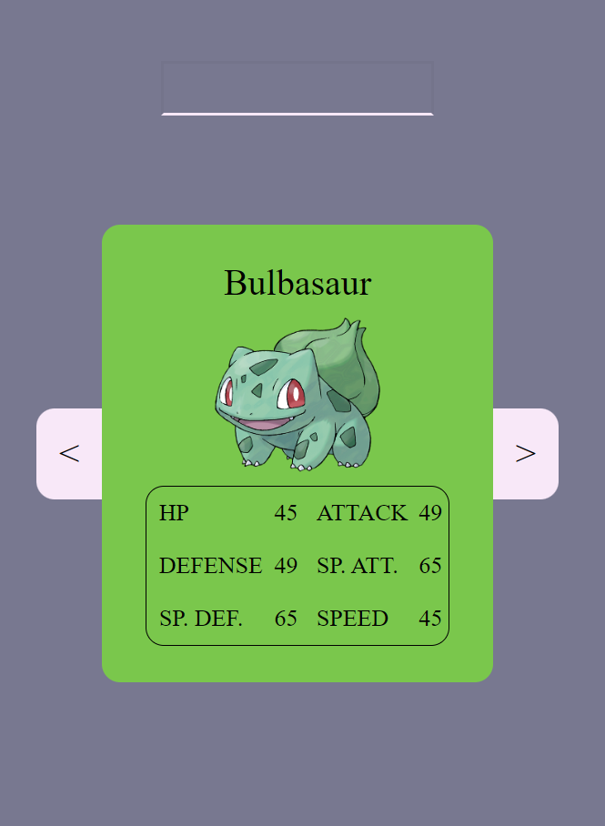

## Table of contents

-   [Overview](#overview)
    -   [Screenshot](#screenshot)
    -   [Links](#links)
-   [My process](#my-process)
    -   [Built with](#built-with)
    -   [What I learned](#what-i-learned)
-   [Author](#author)
-   [Acknowledgments](#acknowledgments)

## Overview

Simple pokedex, using the PokeAPI display all the first gen pokemons.

### Screenshot



<!--  -->

### Links

-   Live Site URL: https://mypokedexsite.netlify.app/

## My process

I put the design together in in this Figma file: https://www.figma.com/file/E6BGv3c7YJXeVLul1FPFd9/Untitled?type=design&node-id=0%3A1&mode=design&t=QIEC7Z7oHc8hrByH-1 I then put the diferrent elements into fitting HTML tags, and started styling it, for mobile only at first. Initially i wrote it in vanilla JS, but changed it to React with Typescript.

### Built with

-   Semantic HTML5 markup
-   CSS custom properties
-   Flexbox
-   Mobile-first workflow
-   API usage
-   Vite + React + TS

### What I learned

Using APIs, React and TS.

## Author

-   Website - [havardekodehode]("portfolioSite")

## Acknowledgments

Thanks to Patryk, who assigned this task.

```

```

```
Pokedex
├─ .eslintrc.cjs
├─ .git
│  ├─ COMMIT_EDITMSG
│  ├─ config
│  ├─ description
│  ├─ HEAD
│  ├─ hooks
│  │  ├─ applypatch-msg.sample
│  │  ├─ commit-msg.sample
│  │  ├─ fsmonitor-watchman.sample
│  │  ├─ post-update.sample
│  │  ├─ pre-applypatch.sample
│  │  ├─ pre-commit.sample
│  │  ├─ pre-merge-commit.sample
│  │  ├─ pre-push.sample
│  │  ├─ pre-rebase.sample
│  │  ├─ pre-receive.sample
│  │  ├─ prepare-commit-msg.sample
│  │  ├─ push-to-checkout.sample
│  │  ├─ sendemail-validate.sample
│  │  └─ update.sample
│  ├─ index
│  ├─ info
│  │  └─ exclude
│  ├─ objects
│  │
│  └─ refs
│     ├─ heads
│     │  └─ main
│     ├─ remotes
│     │  └─ origin
│     │     └─ main
│     └─ tags
├─ .gitignore
├─ index.html
├─ package-lock.json
├─ package.json
├─ public
│  └─ vite.svg
├─ README.md
├─ src
│  ├─ App.css
│  ├─ App.tsx
│  ├─ assets
│  │  ├─ pokeball2.svg
│  │  ├─ previewMobile.png
│  │  └─ react.svg
│  ├─ Components
│  │  ├─ Header
│  │  │  └─ Header.tsx
│  │  ├─ Layout
│  │  │  └─ Layout.tsx
│  │  ├─ Pokedex
│  │  │  ├─ pokedex.module.css
│  │  │  ├─ Pokedex.tsx
│  │  │  ├─ PokemonHeader.tsx
│  │  │  └─ Stats.tsx
│  │  ├─ PokedexContainer
│  │  │  ├─ Loading.tsx
│  │  │  ├─ pokedexContainer.module.css
│  │  │  ├─ PokedexContainer.tsx
│  │  │  ├─ search.module.css
│  │  │  └─ Search.tsx
│  │  └─ SearchResults
│  │     ├─ searchResults.module.css
│  │     └─ SearchResults.tsx
│  ├─ contexts
│  │  └─ contexts.tsx
│  ├─ css
│  │  ├─ animations.css
│  │  ├─ index.css
│  │  ├─ layout.css
│  │  ├─ media-queries.css
│  │  ├─ navigation.css
│  │  ├─ typography.css
│  │  └─ variables.css
│  ├─ data
│  │  ├─ api.ts
│  │  ├─ apiInterfaces.ts
│  │  └─ data.ts
│  ├─ index.css
│  ├─ main.tsx
│  ├─ Utils
│  │  ├─ HTMLElements.ts
│  │  └─ searchUtil
│  └─ vite-env.d.ts
├─ tsconfig.json
├─ tsconfig.node.json
└─ vite.config.ts

```
